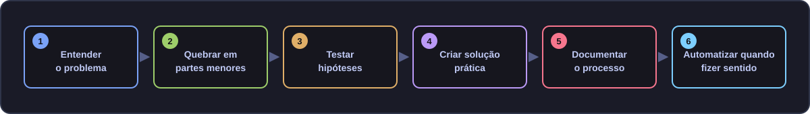
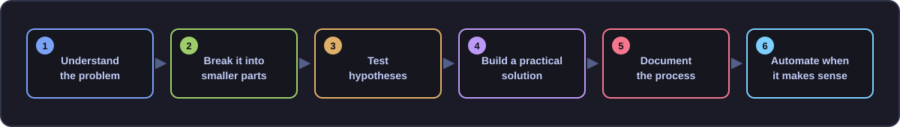

# Leandro Vilela

### Systems Analyst · Infrastructure · Automation · Security · Software Development

**Building practical tools, automation workflows, games and real-world software solutions.**

  
  

  
  
  
  
  

---

## 📊 GitHub Overview

  
  

  
    📌 Dados públicos disponíveis no GitHub · Public GitHub data only. 
    Linguagens representam composição de código, não nível de domínio técnico · Languages reflect code composition, not proficiency.
  

---

<strong>🇧🇷 Português</strong>

 

## 👨‍💻 Sobre mim

Sou um profissional de tecnologia com mais de **20 anos de experiência** em suporte técnico, infraestrutura, redes, segurança da informação, automação e desenvolvimento de soluções para ambientes reais de operação.

Minha trajetória passou por **suporte corporativo, NOC, datacenter, administração de servidores, redes, segurança, cloud, monitoramento e automação**, incluindo atuação em ambientes de alta criticidade e projetos ligados à **B3, Telefónica e ao setor financeiro**.

Hoje concentro grande parte do meu trabalho em algo que sempre fez parte da minha forma de pensar tecnologia: **entender o problema, simplificar o processo e construir uma solução prática**. Isso pode resultar em um script PowerShell, uma ferramenta interna, um sistema fiscal, uma aplicação, um serviço no homelab ou até um jogo.

<blockquote>
  <strong>🎯 Foco atual</strong>  
  Automação, desenvolvimento de ferramentas, sistemas fiscais/comerciais,
  IA local e agentes, containers/Docker, infraestrutura,
  documentação técnica e Game Dev.
</blockquote>

### 🧭 Perfil profissional

| | |
|---|---|
| 🧑‍💻 **Perfil** | Analista de Sistemas com forte base em infraestrutura, suporte, segurança, automação e desenvolvimento |
| 🏗️ **Experiência** | +20 anos em ambientes corporativos, críticos e operacionais |
| 🔎 **Abordagem** | Diagnóstico, testes controlados, documentação e melhoria incremental |
| ⚙️ **Mentalidade** | Transformar tarefas recorrentes em processos confiáveis e reutilizáveis |
| 🎯 **Objetivo** | Criar soluções que façam sentido no ambiente real e continuem sustentáveis depois da entrega |

---

## 🛠️ Tecnologias e ferramentas

| Domínio | Tecnologias / Ferramentas |
|---|---|
| 🖥️ **Sistemas & Servidores** | `Windows Server` · `Linux` · `IIS` |
| 🌐 **Infraestrutura & Redes** | `LAN/WAN` · `VPN` · `SFTP` · `Fortigate` · `IpTables` · Cabeamento Estruturado · Fibra Óptica |
| 🔐 **Segurança & Observabilidade** | `SIEM` · `Splunk` · `Datadog` · `Elastic` · Troubleshooting · Monitoramento |
| ☁️ **Cloud & Containers** | `Azure` · `AWS` · Cloud privada · `Docker` |
| 🗄️ **Dados** | `SQL Server` · `HFSQL` · `PostgreSQL` |
| ⚡ **Automação** | `PowerShell` · `Batch` · scripts e rotinas operacionais |
| 💻 **Desenvolvimento** | `TypeScript` · `Node.js` · `WinDev/WLanguage` |
| 📱 **Apps** | `Dart` · `Flutter` · `Firebase` |
| 🎮 **Game Dev** | `Unity` · `C#` · `Aseprite` |
| 🧬 **Engenharia & Versionamento** | `Git` · `GitHub` · documentação técnica · workflows |
| 🤖 **IA aplicada** | IA local · agentes · RAG · evals · ferramentas assistidas por IA |

---

## 🚀 Projetos em destaque

| Projeto | O que exploro |
|---|---|
| 🧭 [**VillaZ Router**](https://github.com/leovillaz/villaz-router) | Router determinístico para triagem e roteamento de prompts, com normalização, scoring e testes de regressão |
| 📡 [**CCP Monitor SEFAZ**](https://github.com/leovillaz/ccp-monitor-sefaz) | Monitoramento e automação voltados à disponibilidade de serviços fiscais |
| 🎮 [**MemoryPairs**](https://github.com/leovillaz/MemoryPairs) | Jogo mobile em Unity/C#, usado também como laboratório prático de desenvolvimento |
| 🧰 [**VillaZ CLI**](https://github.com/leovillaz/villaz-cli) | Ferramentas de linha de comando dentro do ecossistema de projetos VillaZ |

<blockquote>
  <strong>🔒 Nota</strong>  
  Nem todo projeto em que trabalho é público. Alguns projetos profissionais,
  experimentais ou em desenvolvimento permanecem privados.
</blockquote>

---

## 🧠 Meu jeito de trabalhar

  

| Princípio | Na prática |
|---|---|
| 🔎 **Diagnóstico antes da solução** | Entender causa, contexto e impacto antes de alterar o ambiente |
| 🧪 **Testes controlados** | Validar hipóteses em etapas pequenas e observáveis |
| 📄 **Documentação** | Registrar decisões, procedimentos, riscos e próximos passos |
| 🔁 **Reutilização** | Transformar conhecimento em scripts, templates e processos reaproveitáveis |
| 🧯 **Reversibilidade** | Preservar rollback e evitar mudanças destrutivas sem necessidade |
| 🧱 **Evolução incremental** | Melhorar sem quebrar o que já funciona |

---

## 🤝 Soft skills

| Competência | Como aparece no trabalho |
|---|---|
| 🧩 **Resolução de problemas** | Decomposição de incidentes complexos em hipóteses verificáveis |
| 🗣️ **Comunicação técnica** | Tradução de problemas entre usuários, suporte, infraestrutura e desenvolvimento |
| 📚 **Aprendizado contínuo** | Exploração prática de novas ferramentas sem abandonar fundamentos |
| 🧭 **Organização** | Checkpoints, documentação, versionamento e rastreabilidade de decisões |
| 🛠️ **Ownership** | Interesse em resolver a causa e melhorar o processo, não apenas encerrar o chamado |
| 🤝 **Relacionamento com clientes** | Experiência longa com atendimento corporativo, remoto e presencial |

---

## 📌 Em resumo

Minha base vem de **infraestrutura, suporte e segurança**. Minha evolução passa por **automação, desenvolvimento, IA local e construção de ferramentas próprias**.

Gosto de ambientes em que posso investigar, construir, testar e melhorar.

> **Menos caos, mais método.**  
> Mas sem perder a diversão no processo. 🎮⚙️

---

<strong>🇺🇸 English</strong>

 

## 👨‍💻 About me

I am a technology professional with over **20 years of experience** in technical support, infrastructure, networking, information security, automation and software solutions for real-world operational environments.

My career has taken me through **corporate support, NOC operations, datacenters, server administration, networking, security, cloud, monitoring and automation**, including high-criticality environments and projects connected to **B3, Telefónica and the financial sector**.

Today, much of my work revolves around something that has always shaped the way I approach technology: **understand the problem, simplify the process and build a practical solution**. That solution may be a PowerShell script, an internal tool, a fiscal system, an application, a homelab service or even a game.

<blockquote>
  <strong>🎯 Current focus</strong>  
  Automation, tool development, fiscal/commercial systems,
  local AI and agents, containers/Docker, infrastructure,
  technical documentation and Game Dev.
</blockquote>

### 🧭 Professional profile

| | |
|---|---|
| 🧑‍💻 **Profile** | Systems Analyst with a strong background in infrastructure, support, security, automation and development |
| 🏗️ **Experience** | 20+ years in corporate, critical and operational environments |
| 🔎 **Approach** | Diagnosis, controlled testing, documentation and incremental improvement |
| ⚙️ **Mindset** | Turn recurring tasks into reliable and reusable processes |
| 🎯 **Goal** | Build solutions that make sense in real environments and remain sustainable after delivery |

---

## 🛠️ Technologies and tools

| Domain | Technologies / Tools |
|---|---|
| 🖥️ **Systems & Servers** | `Windows Server` · `Linux` · `IIS` |
| 🌐 **Infrastructure & Networking** | `LAN/WAN` · `VPN` · `SFTP` · `Fortigate` · `IpTables` · Structured Cabling · Fiber Optics |
| 🔐 **Security & Observability** | `SIEM` · `Splunk` · `Datadog` · `Elastic` · Troubleshooting · Monitoring |
| ☁️ **Cloud & Containers** | `Azure` · `AWS` · Private Cloud · `Docker` |
| 🗄️ **Data** | `SQL Server` · `HFSQL` · `PostgreSQL` |
| ⚡ **Automation** | `PowerShell` · `Batch` · operational scripts and routines |
| 💻 **Development** | `TypeScript` · `Node.js` · `WinDev/WLanguage` |
| 📱 **Apps** | `Dart` · `Flutter` · `Firebase` |
| 🎮 **Game Dev** | `Unity` · `C#` · `Aseprite` |
| 🧬 **Engineering & Version Control** | `Git` · `GitHub` · technical documentation · workflows |
| 🤖 **Applied AI** | Local AI · agents · RAG · evals · AI-assisted tooling |

---

## 🚀 Featured projects

| Project | What I explore |
|---|---|
| 🧭 [**VillaZ Router**](https://github.com/leovillaz/villaz-router) | Deterministic prompt triage and routing with normalization, scoring and regression tests |
| 📡 [**CCP Monitor SEFAZ**](https://github.com/leovillaz/ccp-monitor-sefaz) | Monitoring and automation focused on fiscal-service availability |
| 🎮 [**MemoryPairs**](https://github.com/leovillaz/MemoryPairs) | Unity/C# mobile game also used as a practical development lab |
| 🧰 [**VillaZ CLI**](https://github.com/leovillaz/villaz-cli) | Command-line tooling within the VillaZ project ecosystem |

<blockquote>
  <strong>🔒 Note</strong>  
  Not every project I work on is public. Some professional,
  experimental and in-development projects remain private.
</blockquote>

---

## 🧠 How I work

  

| Principle | In practice |
|---|---|
| 🔎 **Diagnosis before solution** | Understand cause, context and impact before changing the environment |
| 🧪 **Controlled testing** | Validate hypotheses through small and observable steps |
| 📄 **Documentation** | Record decisions, procedures, risks and next steps |
| 🔁 **Reusability** | Turn knowledge into reusable scripts, templates and processes |
| 🧯 **Reversibility** | Preserve rollback paths and avoid unnecessary destructive changes |
| 🧱 **Incremental evolution** | Improve systems without breaking what already works |

---

## 🤝 Soft skills

| Skill | How it shows up |
|---|---|
| 🧩 **Problem solving** | Breaking complex incidents into testable hypotheses |
| 🗣️ **Technical communication** | Translating issues across users, support, infrastructure and development teams |
| 📚 **Continuous learning** | Exploring new tools through hands-on work without abandoning fundamentals |
| 🧭 **Organization** | Checkpoints, documentation, version control and decision traceability |
| 🛠️ **Ownership** | Improving root causes and processes instead of only closing tickets |
| 🤝 **Client-facing experience** | Long-term experience with corporate, remote and on-site support |

---

## 📌 In short

My foundation comes from **infrastructure, support and security**. My current evolution goes through **automation, software development, local AI and building my own tools**.

I enjoy environments where I can investigate, build, test and improve.

> **Old school enough to respect the basics.**  
> Curious enough to keep building the next thing. ⚙️🎮

---

## 📫 Contact

  Infrastructure roots · Automation mindset · Builder at heart ⚙️

